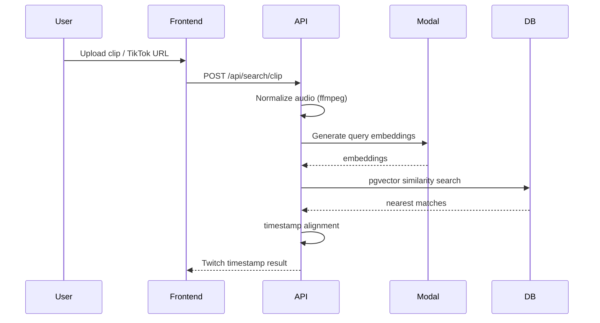
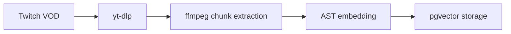

# VodHunter

https://vodhunter.dev/

VodHunter is an audio-based search engine that matches short clips (TikTok, uploads, etc.) to timestamps inside Twitch VODs using vector embeddings and similarity search.

Instead of manually searching through hours of streams, VodHunter allows a user to upload a short clip and instantly locate the exact moment it occurred in a Twitch VOD.

VodHunter helps viewers recover the full context behind viral clips while also helping streamers bring attention back to their original broadcasts. In this way, VodHunter acts as a bridge between short-form content and long-form streams.

---


---

# Core Components

### Frontend

The public interface is a React application that allows users to upload audio clips or paste TikTok URLs.  
The frontend sends search requests to the FastAPI backend and displays matched Twitch timestamps.

### Public API

The backend is a FastAPI service responsible for orchestrating the search pipeline. It performs input validation, audio preprocessing, remote embedding requests, vector search, and timestamp alignment.

Primary responsibilities include:

- handling search requests
- preprocessing audio with ffmpeg
- requesting query embeddings from Modal
- performing vector similarity search
- returning the best matching Twitch timestamp

### Vector Database

Postgres with the **pgvector** extension is used to store audio fingerprint embeddings.  
This allows the system to perform efficient similarity search directly inside the database.

### GPU Embedding Worker

Query embeddings are generated through **Modal** GPU workers during search requests.

### Ingest Pipeline

A separate ingest process converts Twitch VODs into searchable embeddings by extracting audio chunks and storing them in the database.

---

# Search Pipeline

The search pipeline matches a short audio clip against indexed Twitch VODs.


Search process:

1. The clip is normalized into a consistent audio format using **ffmpeg**.
2. **Modal** runs the AST audio model and returns embeddings for the clip.
3. The embeddings are compared against stored fingerprints using **pgvector similarity search**.
4. The system determines the best matching timestamp within the Twitch VOD.

---

# Ingest Pipeline

The ingest pipeline indexes Twitch VODs into searchable embeddings.



Ingest process:

1. Twitch VOD URLs are resolved using **yt-dlp**.
2. Audio is extracted and divided into fixed-length chunks.
3. Each chunk is converted into an embedding using the **AST audio model**.
4. Embeddings are stored in Postgres using **pgvector**.

These stored fingerprints allow the system to later match user clips to the correct VOD timestamp.

---

# Testing

Install dev dependencies with:

```bash
pip install -r backend/requirements-dev.txt
```

Run the Python test suite with:

```bash
python3 -m pytest
```

Keep test-only dependencies in [`backend/requirements-dev.txt`](/Volumes/workstation/twitchVodHunter/VodHunter/backend/requirements-dev.txt), not [`backend/requirements.txt`](/Volumes/workstation/twitchVodHunter/VodHunter/backend/requirements.txt), because local dev/tests still need the full runtime dependency set while the production public API image installs the slimmer [`backend/requirements-api-public.txt`](/Volumes/workstation/twitchVodHunter/VodHunter/backend/requirements-api-public.txt).

---

# License

This project is licensed under the **MIT License**.
