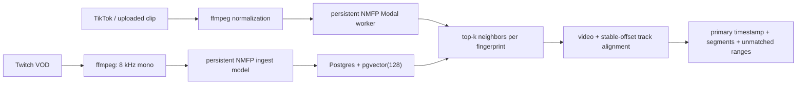

# VodHunter

[vodhunter.dev](https://vodhunter.dev/) searches short-form audio against Twitch VODs. The production search path uses NMFP neural audio fingerprints and can map an edited query to multiple, possibly non-contiguous VOD ranges.

## Production architecture

The ingest and query paths share one immutable fingerprint identity:

- model: `nmfp-triplet@15c6f3bcdf6a6da1daddfe47a1ffa5a0d22deadc+zenodo-15719945+ckpt-100`
- preprocessing: `nmfp-8khz-mono-1s-hop0.5-mel-v1`
- output width: 128 dimensions
- audio: 8 kHz mono, 1-second windows, 0.5-second fingerprint hop

The service rejects a database, worker response, or local runtime whose dimensions or version identifiers differ. Do not change any part of this identity in isolation; a different checkpoint or preprocessing contract requires a new index and a full reindex.


```mermaid
flowchart LR
    VOD["Twitch VOD"] --> Extract["ffmpeg: 8 kHz mono"]
    Extract --> IngestNMFP["persistent NMFP ingest model"]
    IngestNMFP --> Vectors["Postgres + pgvector(128)"]

    Query["TikTok / uploaded clip"] --> Normalize["ffmpeg normalization"]
    Normalize --> Modal["persistent NMFP Modal worker"]
    Modal --> Candidates["top-k neighbors per fingerprint"]
    Vectors --> Candidates
    Candidates --> Align["video + stable-offset track alignment"]
    Align --> Result["primary timestamp + segments + unmatched ranges"]
```

Ingestion resolves VOD media with `yt-dlp`, extracts overlapping audio chunks, fingerprints them locally, and stores the timestamped vectors with the model and preprocessing versions. Search normalizes the query, obtains timestamped fingerprints from a persistent Modal container, retrieves the top 10 candidates for every query fingerprint, and aligns candidates by both video ID and stable `VOD time - query time` offset.

The public endpoint is asynchronous: `POST /api/search/clip` creates a job and `GET /api/search/clip/{search_id}` returns its state and durable result. The admin endpoint uses the same search pipeline synchronously and also accepts direct file uploads. A successful result retains the legacy top-level timestamp/URL while adding `segments` and `unmatched_ranges`.

NMFP only reports ranges with enough consistent evidence. Very short sections, fully overlaid audio, silence, heavy transformation, or isolated nearest neighbors can remain unmatched. An unmatched range is an honest lack of support, not proof that the source audio never occurred in a VOD.

## Cut-aware alignment defaults

All alignment thresholds are environment-configurable:

| Setting | Default | Environment variable |
|---|---:|---|
| neighbors per fingerprint | 10 | `SEARCH_TOP_K` |
| fingerprint hop | 0.5 s | `NMFP_HOP_SECONDS` |
| offset bin | 0.5 s | `CUT_OFFSET_BIN_SECONDS` |
| offset tolerance within a track | +/- 1 s | `CUT_OFFSET_TOLERANCE_SECONDS` |
| maximum unsupported gap | 2 s | `CUT_MAX_UNMATCHED_GAP_SECONDS` |
| minimum support | 6 fingerprints | `CUT_MIN_SUPPORT` |
| minimum segment duration | 4 s | `CUT_MIN_SEGMENT_DURATION_SECONDS` |
| minimum density | 0.4 | `CUT_MIN_DENSITY` |
| merge query gap | 1 s | `CUT_MERGE_QUERY_GAP_SECONDS` |
| merge offset tolerance | 4 s | `CUT_MERGE_OFFSET_TOLERANCE_SECONDS` |
| maximum returned segments | 12 | `CUT_MAX_SEGMENTS` |

Treat these as tuned defaults, not guarantees. Evaluate changes against representative edits before rollout.

## Setup and operations

Copy `.env.example` to an ignored `.env`, fill secrets locally, and keep the pinned NMFP values unchanged. Production API and NMFP worker dependencies are intentionally separated; see the requirements files for each runtime.

The production schema migration is destructive to incompatible fingerprint data by design. The old production database no longer exists, so rollout assumes a fresh database or a complete rebuild rather than a zero-downtime vector conversion. Apply migrations and run the guarded first backfill as described in [NMFP production operations](docs/nmfp-production-operations.md). That guide also covers resumability, version checks, metrics, and rollback boundaries.

No deployment, Modal publish, or external database creation is performed by repository commands unless an operator explicitly runs the relevant external tooling.

## Latency measurements

The experiment's roughly 231-240 ms median was cached NMFP alignment using already-extracted query fingerprints. It excluded TensorFlow/container startup and query fingerprint extraction, so it is not end-to-end production latency.

Production records audio normalization, cold model startup, fingerprint preprocessing/inference/total extraction, vector retrieval, cut alignment, and total request latency separately. Compare cold requests with cold requests and warm requests with warm requests; do not present the cached experiment number as upload-to-result latency.

## Testing

Run the Python suite with:

```bash
python3 -m pytest
```

The frontend packages have their own build/test commands under `web-public` and `web-admin`.

## Third-party licensing status

The upstream `neural-music-fp` implementation used by NMFP is identified as AGPLv3. The product owner confirmed that the production licensing decision is resolved for this migration. Preserve the upstream notices and the separately distributed checkpoint terms when packaging the worker.

## License

VodHunter's own source is licensed under the MIT License.
