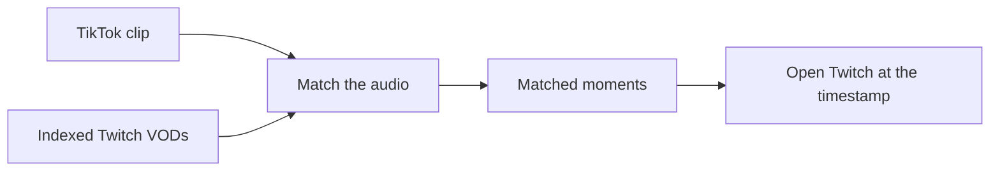

# VodHunter

Find the original Twitch moment behind a TikTok clip.

[Try VodHunter at vodhunter.com](https://vodhunter.com/)

VodHunter matches a clip's audio to a streamer's Twitch VODs and gives you links
to the matching timestamps. An edited clip can contain several moments, even
from different VODs. VodHunter groups the matches by source so you can open each
one.

## Find a moment

1. Paste a TikTok link and choose a streamer.
2. Narrow the search by date if you know when the stream happened.
3. Open a match to jump to that moment in the original Twitch VOD.

Your search history lets you revisit previous results. You can also share a
result link or reopen a search while it is still running.

On iPhone, the site's **iPhone shortcut** button lets you add **Search with
VodHunter** to your share sheet. Then you can start a search directly from TikTok.

## How it works

VodHunter turns audio from Twitch VODs into neural fingerprints, each tied to a
timestamp. It fingerprints the TikTok audio, finds similar fingerprints, and
checks that they line up into consistent stretches of audio.

```mermaid
flowchart LR
    Clip["TikTok clip"] --> Audio["Match the audio"]
    VODs["Indexed Twitch VODs"] --> Audio
    Audio --> Moments["Matched moments"]
    Moments --> Watch["Open Twitch at the timestamp"]
```

Search covers the VODs VodHunter has indexed for the selected streamer. Very
short clips, heavy music overlays, or heavily altered audio can leave some or
all of a clip unmatched.

## License

VodHunter's own source is licensed under the MIT License.
